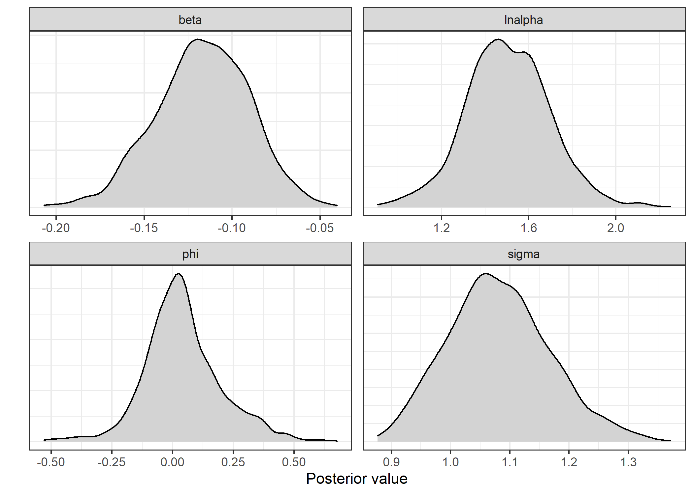
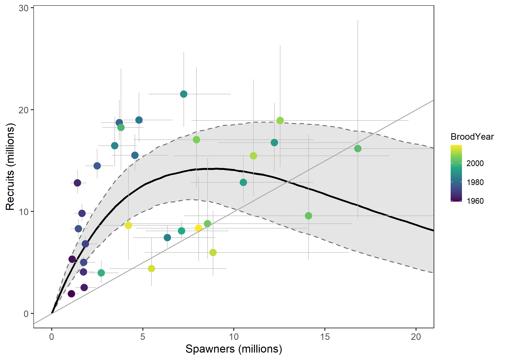
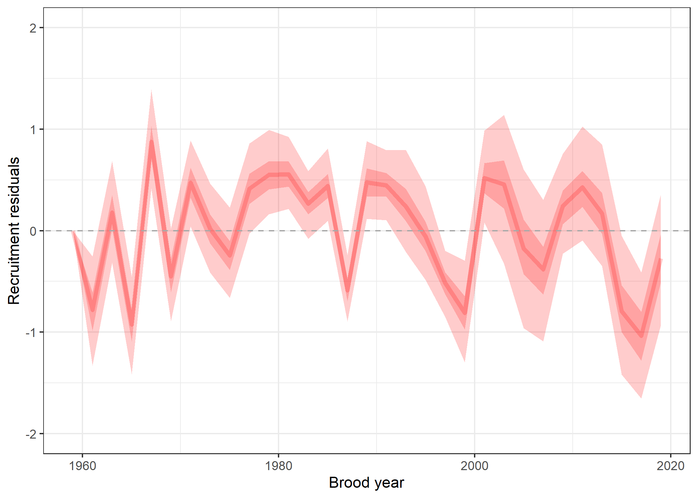
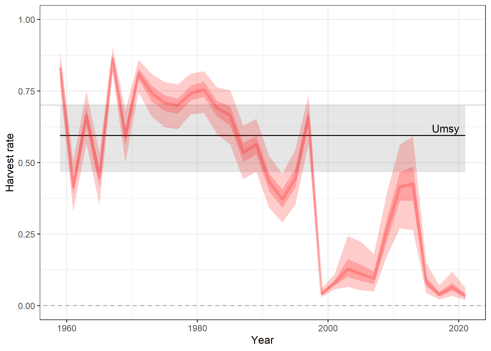
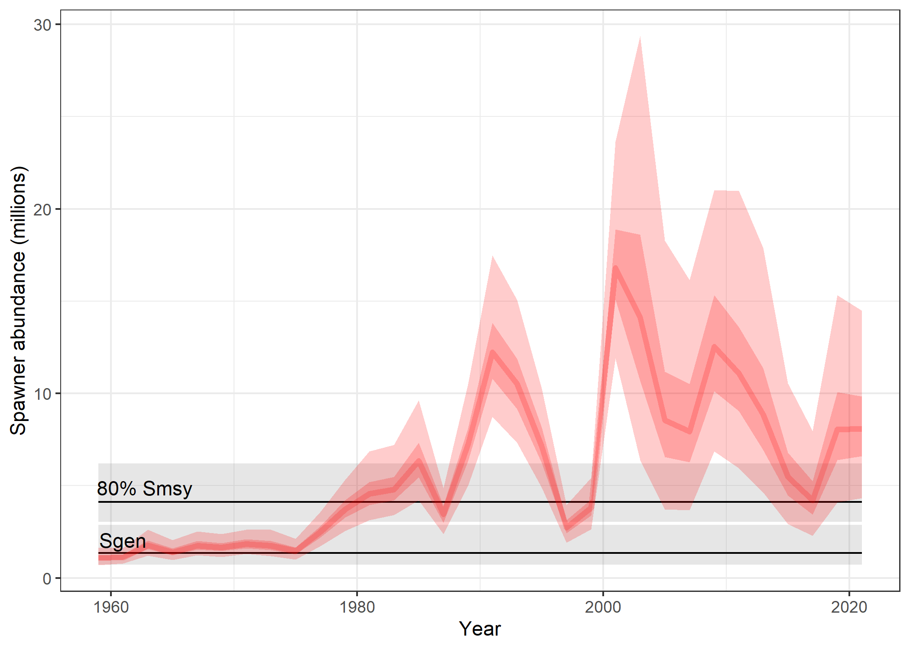
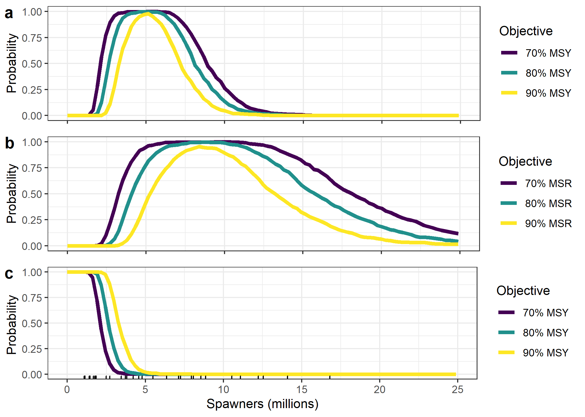

```{=html}
<style type="text/css">

body{ /* Normal  */
      font-size: 15px;
  }
td {  /* Table  */
  font-size: 13px;
}
h1.title {
  font-size: 24px;
  color: Black;
}
h1 { /* Header 1 */
  font-size: 19px;
  color: Black;
}
h2 { /* Header 2 */
    font-size: 15px;
  color: Black;
}
</style>
```


# Background
This doc summarizes preliminary exploratory analysis of Fraser pink salmon spawner-recruitment relationship and associated biological benchmarks. Repository with all data and code to reproduce the analysis, and this doc, can be found [here](https://github.com/Pacific-salmon-assess/fraser-pinks) .  

# Data and model formualtion
First, a quick look at the raw escapement and harvest time series.  


Note spawning escapement has been estimated with various methods over the years which vary in their precision, and which are likely less precise than estimates of harvest. We would like to account for this time varying observation error when estimating the shape of the spawner-recruitment relationship. To do this I fit a state-space spawner recruitment model to the estimates of spawner abundance and harvest. The model is similar to the one originally described in [Fleischman et al. 2013](https://cdnsciencepub.com/doi/full/10.1139/cjfas-2012-0112) but without age-structure given the fixed two-year pink salmon life cycle. 

The model assumed a Ricker type spawner-recruitment relationship with serially correlated recruitment residuals and was parameterized with a log-normal bias correction applied directly to the likelihood for the process model. Observation error CVs on escapement that were specified for the observation model, and which are just place holders for now, were: 

<table class="table table-striped table-hover" style="margin-left: auto; margin-right: auto;">
 <thead>
  <tr>
   <th style="text-align:center;"> Years </th>
   <th style="text-align:right;"> Method </th>
   <th style="text-align:right;"> CV </th>
  </tr>
 </thead>
<tbody>
  <tr>
   <td style="text-align:center;"> 1957-1985 </td>
   <td style="text-align:right;"> PSC mark-recapture (system specific) </td>
   <td style="text-align:right;"> 20% </td>
  </tr>
  <tr>
   <td style="text-align:center;"> 1987-1991 </td>
   <td style="text-align:right;"> DFO mark-recapture (system specific) </td>
   <td style="text-align:right;"> 20% </td>
  </tr>
  <tr>
   <td style="text-align:center;"> 1993-2001 </td>
   <td style="text-align:right;"> DFO mark-recapture (mainstem) </td>
   <td style="text-align:right;"> 20% </td>
  </tr>
  <tr>
   <td style="text-align:center;"> 2003-2007 </td>
   <td style="text-align:right;"> Test fishery </td>
   <td style="text-align:right;"> 50% </td>
  </tr>
  <tr>
   <td style="text-align:center;"> 2009-2011 </td>
   <td style="text-align:right;"> Mission post-season </td>
   <td style="text-align:right;"> 35% </td>
  </tr>
  <tr>
   <td style="text-align:center;"> 2013-2021 </td>
   <td style="text-align:right;"> Mission in-season </td>
   <td style="text-align:right;"> 35% </td>
  </tr>
</tbody>
</table>
And I assumed a 5% CV on harvest for all year (again as a placeholder).

I fit the spawner-recruitment model in the [Stan Bayesian modelling platform](https://mc-stan.org/), using the [rstan](https://mc-stan.org/rstan/index.html) package. More details on model structure, priors, diagnostics, etc. can be found in the `analysis` sub-folder of [the repository](https://github.com/Pacific-salmon-assess/fraser-pinks) 

# Spawner-recruitment relationship

Here are posterior distributions for a few key parameters including magnitude of within-stock density dependence (beta), intrinsic productivity (ln alpha), serial correlation in recruitment residuals (phi) and magnitude of recruitment variation (sigma).

And this is what the spawner-recruitment relationship looks like. 




Here are the recruitment deviations over time which suggest little evidence for directional change in productivity, though last three brood years have all been below average. 


# Benchmarks and status

Here are estimated benchmarks (all values are in units of millions of fish except U~MSY~). Under the Wild Salmon Policy 80% of S~MSY~ is typically used as the upper biological benchmark, and S~GEN~ as the lower biological benchmark ([Holt and Bradford. 2011](https://www.tandfonline.com/doi/abs/10.1080/02755947.2011.578525)). Also shown are the 25th and 50th percentiles which have been proposed as alternative lower and upper benchmarks for data limited stocks ([Holt et al. 2018](https://www.dfo-mpo.gc.ca/csas-sccs/Publications/ResDocs-DocRech/2018/2018_011-eng.html)). 
<table class="table table-striped table-hover" style="margin-left: auto; margin-right: auto;">
 <thead>
  <tr>
   <th style="text-align:left;">   </th>
   <th style="text-align:center;"> median </th>
   <th style="text-align:right;"> lower.CI </th>
   <th style="text-align:right;"> upper.CI </th>
  </tr>
 </thead>
<tbody>
  <tr>
   <td style="text-align:left;"> 80% Smsy </td>
   <td style="text-align:center;"> 4.0688 </td>
   <td style="text-align:right;"> 3.0068 </td>
   <td style="text-align:right;"> 6.0402 </td>
  </tr>
  <tr>
   <td style="text-align:left;"> Sgen </td>
   <td style="text-align:center;"> 1.3279 </td>
   <td style="text-align:right;"> 0.6908 </td>
   <td style="text-align:right;"> 2.6846 </td>
  </tr>
  <tr>
   <td style="text-align:left;"> Umsy </td>
   <td style="text-align:center;"> 0.5947 </td>
   <td style="text-align:right;"> 0.4659 </td>
   <td style="text-align:right;"> 0.7013 </td>
  </tr>
  <tr>
   <td style="text-align:left;"> 25th percentile </td>
   <td style="text-align:center;"> 1.9233 </td>
   <td style="text-align:right;"> NA </td>
   <td style="text-align:right;"> NA </td>
  </tr>
  <tr>
   <td style="text-align:left;"> 50th percentile </td>
   <td style="text-align:center;"> 4.5600 </td>
   <td style="text-align:right;"> NA </td>
   <td style="text-align:right;"> NA </td>
  </tr>
</tbody>
</table>

This is what reconstructed harvest rate looks like over time relative to U~MSY~.  


And here is what reconstructed spawner abundance looks like over time relative to upper (80% S~MSY~) and lower (S~GEN~) biological benchmarks. 


# Profiles

We can also visualize expected yield and recruitment as a function of spawning escapement via "optimal" yield, recruitment and overfishign profiles. In panel (a) the optimal yield profile illustrates the probability that a given spawner abundance is expected to achieve 70%, 80%, or 90% of maximum sustainable yield (MSY). In panel (b) the optimal recruitment profile illustrates the probability that a given spawner abundance is expected to achieve 70%, 80%, or 90% of maximum sustainable recruitment (S~MSR~). In panel (c) the overfishing profile illustrates the probability that sustained yield (SY) is reduced to less than a percentage (70%, 80%, or 90%) of MSY given a fixed level of escapement and is calculated as 1 – P(SY > X% of MSY) at S < S~MSY~ , and 0 at S > S~MSY~ Historic spawning escapements are shown along x-axis.



# Next steps

Initial thoughts on some next steps include:

- come up with a way to specify defensible observation error CVs on spawner time-series (e.g., from mark-recapture estimates) over time.
- identify alternative scenarios to consider for sensitivity analysis (e.g., assume some magnitude of bias for some years of escapement estimates to quantify sensitivity to violation of assumption that escapement estimates are un-biased?)
- track-down published length-fecundity relationship(s) for pinks and any data on sex-ratios to develop a total egg (or egg mass) based spawner-recruitment relationship that would allow for explicit consideration of consequences of declining pink salmon size for benchmarks.  
- Do some simple forward projections of existing (and alternative) harvest control rule with plausible magnitude of implementation error and sumarize performance relative to fishery and conservation objectives.   
